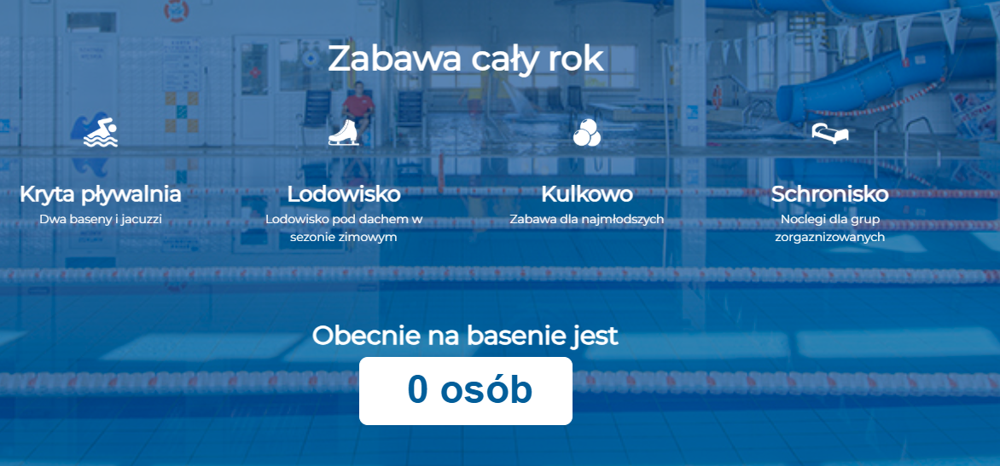
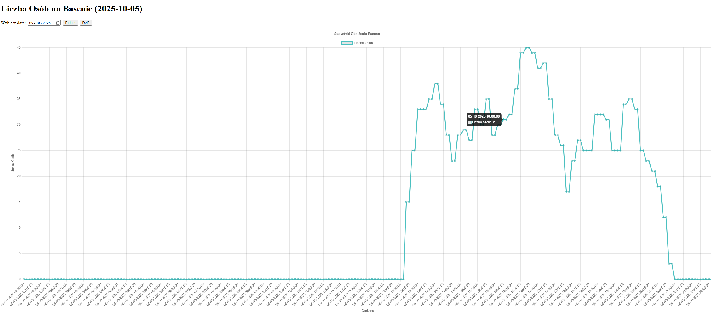
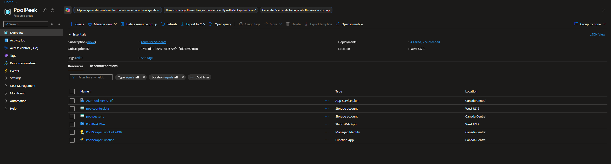
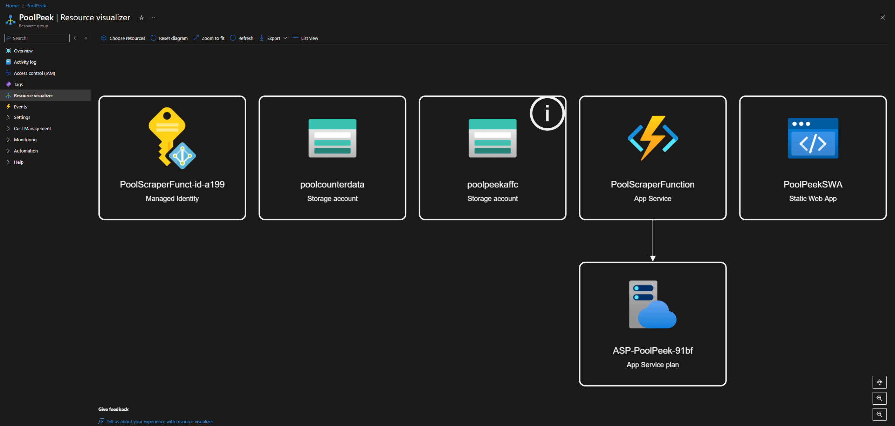

# Pool Peek – Cloud-Based Pool Occupancy Tracker

Pool Peek is a project for monitoring the number of people in a swimming pool by scraping the pool's website and storing the data in Azure Table Storage. The data can be analyzed and visualized on line charts.

**Pool Peek** is a cloud-native application built on Microsoft Azure. It automatically scrapes the occupancy data from a swimming pool website, stores it in Azure Table Storage, and provides visual insights through a web dashboard. The project demonstrates serverless architecture using Azure Functions, CI/CD deployment with GitHub Actions, and integration with Azure Static Web Apps.

## Features

- Automatic scraping of the people count every 15 minutes using an Azure Function Timer Trigger
- Data storage in Azure Table Storage with date and time
- Visualization of daily statistics on line charts
- Frontend and API deployment using Azure Static Web Apps
- Automatic deployment of the scraper function via GitHub Actions

## Project Architecture

- **Frontend:** Azure Static Web App  
- **Backend API:** Azure Function App  
- **Scraper:** Azure Function App (Python)  
- **Storage:** Azure Table Storage  
- **Deployment:** GitHub Actions CI/CD

## Deployment

- **Frontend + API:** Automatically deployed via GitHub Actions to Azure Static Web App  
- **Scraper:** Automatically deployed via GitHub Actions to Azure Function App  
- **Timer Trigger:** Runs the scraper every 15 minutes

## Sample Screenshots

### Web Counter 1

### Daily Statistics Chart

### Azure Resource 1

### Azure Resource 2

## Repository Structure

- `frontend/` – frontend code for SWA  
- `api/PoolApiFunction` – backend API for SWA  
- `functions/PoolScraperFunction` – Azure Function scraper  
- `public/js` – additional frontend files  
- `.github/workflows` – GitHub Actions workflows for deployment

## Technologies

- Python 3.12  
- Azure Functions  
- Azure Table Storage  
- Azure Static Web Apps  
- GitHub Actions  
- BeautifulSoup  
- Requests  
- Matplotlib / Chart.js (for frontend charts)

## Notes

- The scraper function requires the correct pool website URL and HTML selector  
- Logs can be viewed via Kudu or Application Insights  
- Timer Trigger runs in UTC; local time adjustments require conversion
